# Getting started with the development ecosystem for PSOC&trade; Edge E84 training manual

## About this document

This training manual provides a comprehensive guide to getting started with the PSOC&trade; Edge E84 MCU, including detailed instructions on creating, configuring, building, and running application code examples using ModusToolbox&trade;.

## Scope and purpose

In this training, you will learn how to:

1. Explore the development ecosystem for PSOC&trade; Edge E84, including its software and hardware tools
2. Create, build, and program your first PSOC&trade; Edge application using ModusToolbox&trade;
3. Configure and rename pins using the Device Configurator
4. Use the inter-processor communication (IPC) PDL driver to synchronize access to a shared resource between the CM33 and CM55 cores

## Intended audience

This manual is intended for embedded developers, application engineers, and technical users who are new to PSOC&trade; Edge and ModusToolbox&trade;.

### Contents

- [About this document](#about-this-document)
- [Scope and purpose](#scope-and-purpose)
- [Intended audience](#intended-audience)
- [Contents](#contents)
- [Introduction](#introduction)
- [Required development tools and prerequisites](#required-development-tools-and-prerequisites)
- [Lab 1: Hello world + Blinky](#lab-1-hello-world-blinky)
- [Lab 2: IPC semaphore using PDL](#lab-2-ipc-semaphore-using-pdl)
- [Appendix A: Creating a PSOC&trade; Edge application in ModusToolbox&trade;](#appendix-a)
- [Appendix B: KIT_PSE84_EVAL details](#appendix-b-kit_pse84_eval-details)
- [Revision history](#revision-history)
- [Disclaimer](#disclaimer)

## Introduction

PSOC&trade; Edge E84 series of Arm® Cortex®-M MCUs feature high-performance, low-power, secured MCUs with advanced machine learning (ML) acceleration for next-generation AI/ML applications.

The PSOC&trade; Edge E84 MCUs are based on Arm® Cortex®-M55, with Helium DSP support paired with Ethos-U55 NPU as well as a low-power Cortex®-M33 paired with Infineon’s ultra-low power NNLite hardware accelerator and advanced HMI interfaces, including graphics.

This introductory course to the PSOC&trade; Edge development ecosystem delivers a thorough overview of its software and hardware tools, with detailed, step-by-step guidance to help you quickly build your first application.

## Required development tools and prerequisites

### Tools

#### Hardware

- [PSOC&trade; Edge E84 Evaluation Kit](https://www.infineon.com/evaluation-board/KIT-PSE84-EVAL) (KIT_PSE84_EVAL)
  - Ensure BOOT SW (SW6) should be in 'High'/ON position
  - Ensure J20 and J21 should be in the Tristate/Not-Connected (NC) position
  - See [Appendix B: KIT_PSE84_EVAL details](#appendix-b-kit_pse84_eval-details) for more details

#### Software

- ModusToolbox&trade; software v3.9 or later
    - Recommended installation via the [ModusToolbox&trade; Setup tool](https://softwaretools.infineon.com/tools/com.ifx.tb.tool.modustoolboxsetup)
- Visual Studio Code with the **Infineon ModusToolbox&trade; for VS Code** extension v1.10.0 or later
    - Install [Visual Studio Code](https://code.visualstudio.com/), then install the extension from the VS Code Marketplace. The extension can also install the ModusToolbox&trade; software for you if it is not already present

> **Note:** Command-line (CLI) instructions are also provided in [Appendix A: Creating a PSOC&trade; Edge application in ModusToolbox&trade;](#appendix-a).

- Edge Protect Security Suite v2.2.0 or later
    - Installed by the ModusToolbox&trade; Setup tool as a dependency to ModusToolbox&trade; v3.9
- ModusToolbox&trade; Programming Tools v1.9.0 or later
    - Installed by the ModusToolbox&trade; Setup tool as a dependency to ModusToolbox&trade; v3.9
- Board support package (BSP)
    - KIT_PSE84_EVAL_EPC2 v1.4.0 or later, available with ModusToolbox&trade; v3.9
- Serial terminal emulator
    - Use Tera Term, PuTTY, or a similar terminal emulator

> **Note:** Different versions of tools and evaluation kits are expected to work with minor or no changes.

### Prerequisites

- Install the software and obtain the hardware listed above.
- This is an introductory training to PSOC&trade; Edge and ModusToolbox&trade;; however, it is not intended to cover all basic concepts
    - For an introduction to PSOC&trade;, including a getting started guide to ModusToolbox&trade;, visit [https://www.infineon.com/product-information/psocdeveloper](https://www.infineon.com/product-information/psocdeveloper).
    - For PSOC&trade; Edge trainings, from beginner tutorials to advanced trainings, go to [PSOC&trade; Edge Training Collection](https://infineon-academy.csod.com/samldefault.aspx?ouid=1&returnURL=%252fDeepLink%252fProcessRedirect.aspx%253fmodule%253dphnxdriver%2526routename%253dAdmin%252fPlayerPageRedirectHandler%2526Route%253d%25252flms-learner-playlist%25252fPlaylistDetails%2526Parameters%253dplaylistId%25253d8f04565f-88f4-4ca7-83b3-22e501656fbd).

## Lab 1: Hello world + Blinky

### Objective

This code example shows how to implement simple UART communication by printing a **Hello world** message on a terminal. It also blinks an LED using a timer resource in the PSOC&trade; Edge E84 MCU. The code example uses the Peripheral Driver Library (PDL) and Device Configurator included in ModusToolbox&trade;.

### Description

This code example demonstrates the following algorithm flow:

- **Step 1**: Initialize peripherals such as UART and GPIO
- **Step 2**: Print "Hello World" on the serial terminal using UART
- **Step 3**: Blink the LED through the GPIO

### Flow chart

The flow of the **PSOC&trade; Edge MCU: Hello world** project is as follows:

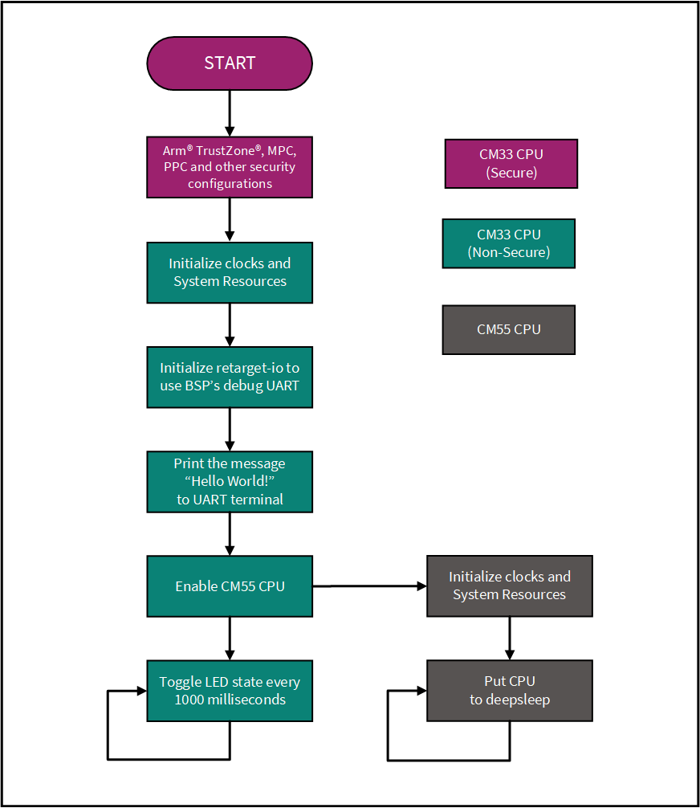

### Hardware diagram

Below is the hardware block diagram for this example:

- UART pins:
	- P6_7 (UART_TX)
	- P6_5 (UART_RX)
- GPIO LED pin:
	- P16_7 (LED)

> **Note:** This example requires BOOT SW in the ON position.

See [Appendix B: KIT_PSE84_EVAL](#appendix-b-kit_pse84_eval-details) for more details.

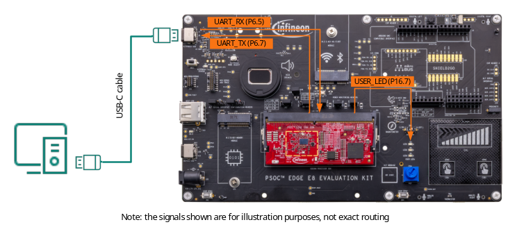

### Project creation

1. Follow the steps in [Appendix A: Creating a PSOC&trade; Edge application in ModusToolbox&trade;](#appendix-a) to create a new application

2. When creating the application, select the **PSOC&trade; Edge Hello World** application under the **Getting Started** section
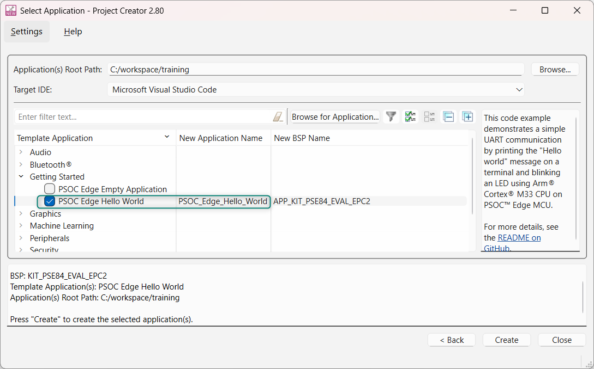

3. Build and program the application. In the ModusToolbox&trade; Assistant **Application** tab, click **Program** (this also builds the project).

> **Note:** Make sure the top-level application, not an individual project, is selected to ensure all three projects (`cm33_s`, `cm33_ns`, and `cm55`) are built and programmed together. If you select an individual project instead, ModusToolbox&trade; builds and programs only that project.
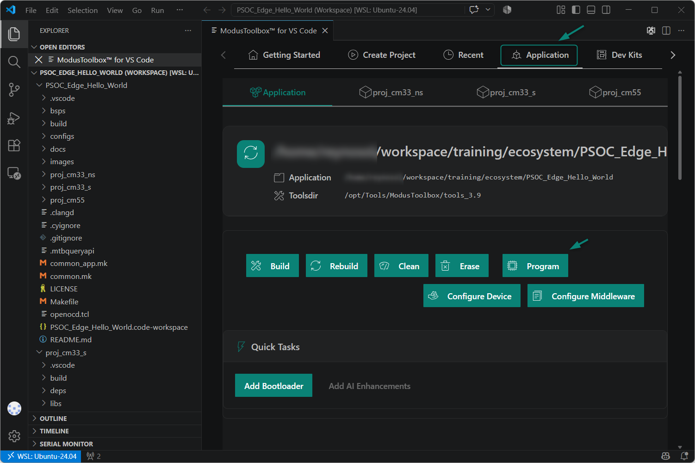

### Output

After the program runs successfully, open the serial terminal and configure the baud rate to 115200-8-N-1. Then press the kit reset button. A message is printed as shown below, and the kit LED blinks at approximately 1 Hz.

### Configure and rename a pin using the Device Configurator

The Device Configurator provides a graphical view of device peripherals, and it generates macros, data structures, and initialization functions based on your selections. The BSP function `cybsp_init()` calls the generated functions to set up the clocks, pins, and internal routing. It is typically called from the `main()` function before using on-chip peripherals such as serial blocks and timer/counters.

When you launch the Device Configurator from VS Code, you are opening the project's `design.modus` file, which holds all the BSP configuration information. It contains the following:

- Selected device
- Resource parameters
- Constraints

Next, configure or rename the pins using the **Device Configurator**.

1. Open the **Device Configurator** tool by clicking **Configure Device** from the **Application** tab of the ModusToolbox&trade; Assistant
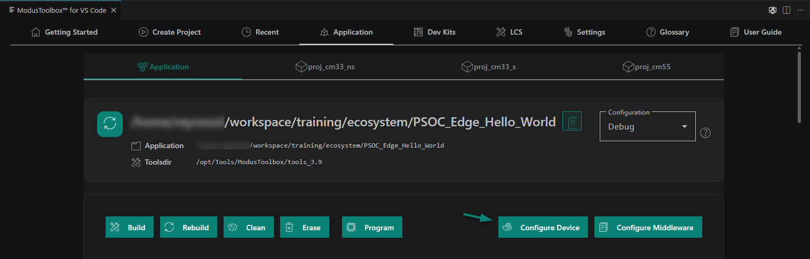

2. [INFO] The Device Configurator includes the following tabs:

   - **Peripherals**: configures peripherals, including communication, digital, and system
   - **Analog**: configures analog modules, including the autonomous analog (ADC, PTComps, autonomous controller, CTBs, and PRB) and the low-power comparators
   - **Pins**: configures the GPIOs, including Smart I/O functionality
   - **Clocks**: configures the device clock tree, including all clock inputs and outputs
   - **System**: configures security, protection, and system settings such as debug and power modes
   - **Memory**: configures the memory allocation and provides a graphical view of the memory map
   - **DMA**: configures the device's DMAs

   You can navigate through the different tabs. The Device Configurator generates code only when the `design.modus` file is saved.

3. In the Device Configurator, go to the **Pins** tab
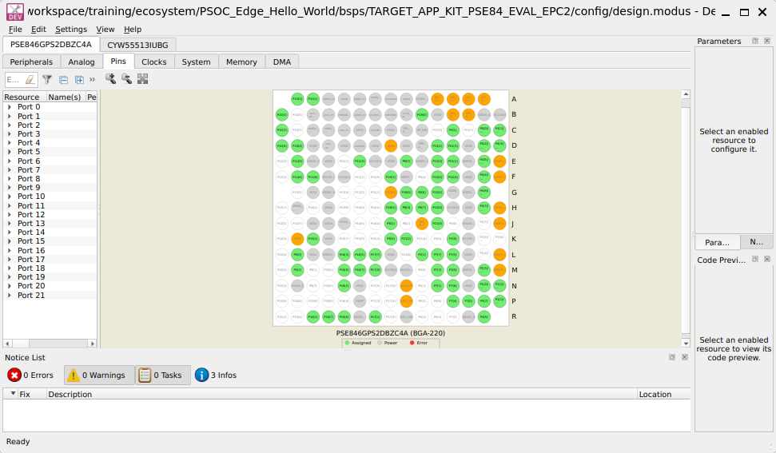

4. [INFO] On this development kit, the three user LEDs are connected to Port 16, pins 5, 6, and 7, as per the kit schematic

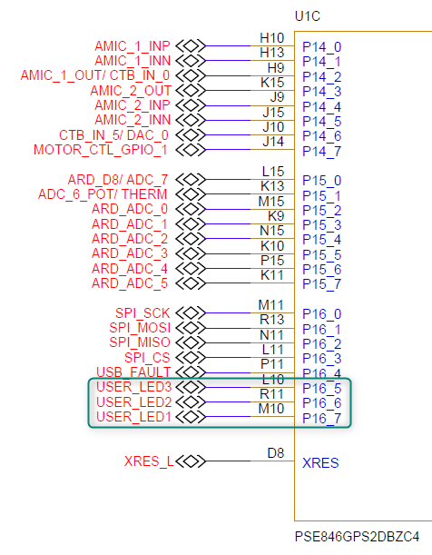

   Each pin can be uniquely identified by giving it a name of your choice. These names are known as *aliases*. In the code, aliases can be used to refer to pins instead of explicit pin numbers.
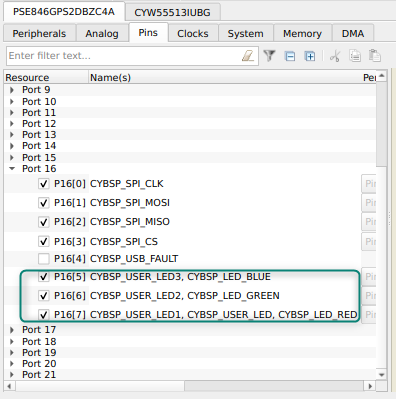

5. Rename **Port 16[7]** as `TRAINING_LED`. This LED is used later in the application
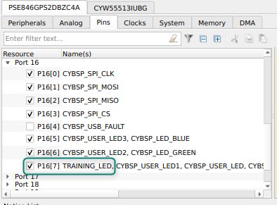
6. Select **File → Save** or press **Ctrl+S** to save the change and regenerate the source files
7. [INFO] Changes made in the Device Configurator take effect once you save the file. Open the `cycfg_pins.h` file (located at `<application-directory>\bsps\TARGET_APP_KIT_PSE84_EVAL_EPC2\config\GeneratedSource\cycfg_pins.h`) to observe the pin definitions and aliases. The change is reflected in the file as follows:
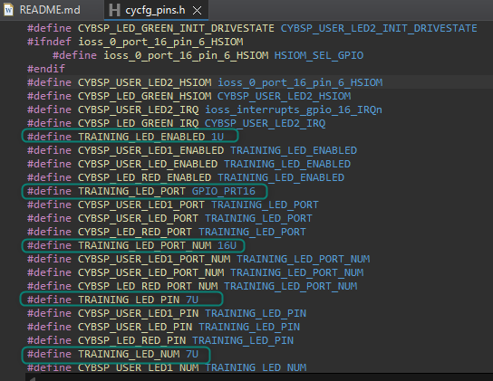

8. [INFO] The Device Configurator includes links to documentation. Click the link in the **Parameters** window to open and navigate through the GPIO documentation. The documentation is also available in the [PSOC&trade; E8XXGP Device Support Library](https://infineon.github.io/mtb-dsl-pse8xxgp/html/group__group__gpio.html)
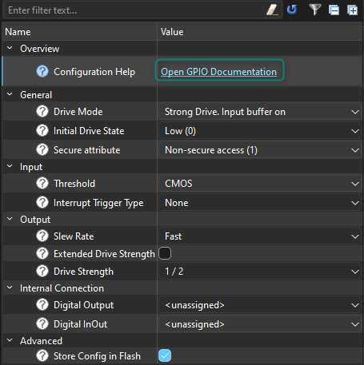
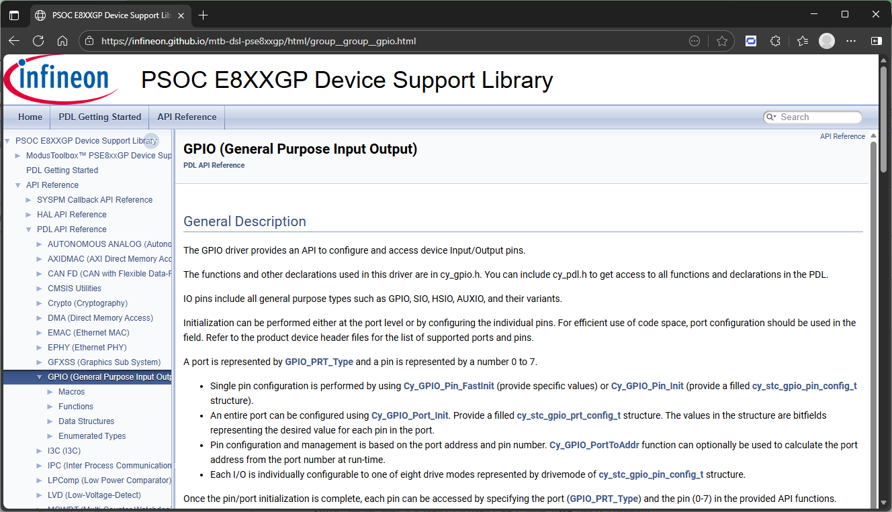

9. [INFO] In the **EXPLORER** view, observe three folders named `PSOC_Edge_Hello_World.proj_cm33_ns`, `PSOC_Edge_Hello_World.proj_cm33_s`, and `PSOC_Edge_Hello_World.proj_cm55`. Each folder contains a `main.c` file that holds the application code for the corresponding project

10. Open the `main.c` file under `PSOC_Edge_Hello_World.proj_cm33_ns`. Inside the infinite `for` loop, change the `CYBSP_USER_LED1_PORT` macro to `TRAINING_LED_PORT` and `CYBSP_USER_LED1_PIN` to `TRAINING_LED_PIN`
```c
for(;;) {
    Cy_GPIO_Inv(TRAINING_LED_PORT, TRAINING_LED_PIN);
    Cy_SysLib_Delay(BLINKY_LED_DELAY_MSEC);
}
```

11. **Save** the file. The application code for `proj_cm33_ns` is now complete

12. **Rebuild and reprogram** the application

13. After the program runs successfully, open the serial terminal and configure the baud rate to 115200-8-N-1. Then reset the kit. The same application runs, and the kit LED continues blinking at approximately 1 Hz

### Conclusion

In this lab, you created your first PSOC&trade; Edge E84 MCU application using ModusToolbox&trade;, modified code using PDL libraries, printed a message in a terminal, and blinked an LED.

This confirms that the device, EVK, and tools are functional.

## Lab 2: IPC semaphore using PDL

### Objective

This lab exercise demonstrates how to use the inter-processor communication (IPC) PDL driver to implement a simple semaphore scheme with PSOC&trade; Edge. A semaphore is used to manage access to a common resource, such as a UART, between the CPUs.

This guide utilizes the Hello World example to show the step-by-step process to add IPC semaphores and shows features like the Library Manager and software documentation; however, ModusToolbox&trade; includes the [mtb-example-psoc-edge-ipc-sema](https://github.com/Infineon/mtb-example-psoc-edge-ipc-sema) code example, which showcases this functionality in a ready-to-use project.

### Description

A shared IPC semaphore is used to coordinate access to a common resource between the two CPUs. In this example, the resource is the UART: each CPU prints a message to the computer terminal over the UART whenever the user button is pressed. Before printing, both CPUs try to acquire the semaphore. If successful, the CPU prints the message and then releases the semaphore. If the semaphore is already held, it keeps trying until it can acquire it.

Without the semaphore to synchronize access to the UART, messages from both CPUs overlap. The following flow chart shows how the code operates.

### Flow chart

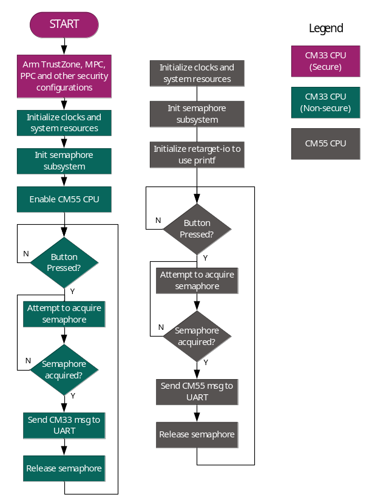

### Hardware diagram

Below is the hardware block diagram for this example:

- UART pins:
	- P6_7 (UART_TX)
	- P6_5 (UART_RX)
- GPIO LED pin:
	- P16_7 (LED)
- Button pin:
	- P8_3 (USER_BTN1)

> **Note:** This example requires BOOT SW in the ON position.

See [Appendix B: KIT_PSE84_EVAL details](#appendix-b-kit_pse84_eval-details) for more details.

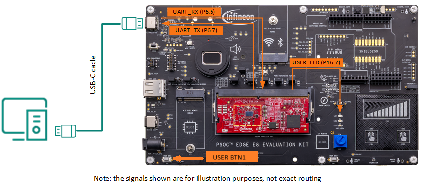

### Project creation

This lab utilizes the same hello world example from Lab 1: Hello world + Blinky. Alternatively, create a new Hello World example and name it differently.

### Enabling retarget-io on CM55

The Hello World example uses the `retarget-io` library to print debug information from the CM33 project using UART. This section shows how to use the **Library Manager** to do the same on the CM55 core.

1. Open the **Library Manager** by clicking the **Configure Middleware** button in the **Application** tab of the ModusToolbox&trade; Assistant, or run `make library-manager` from a terminal. The Library Manager provides a GUI to select which Board Support Package (BSP) is used when building a ModusToolbox&trade; application. The tool collects a list of available and currently selected BSPs and libraries, along with the necessary metadata from a web service. You can add and remove BSPs and libraries, as well as change their versions
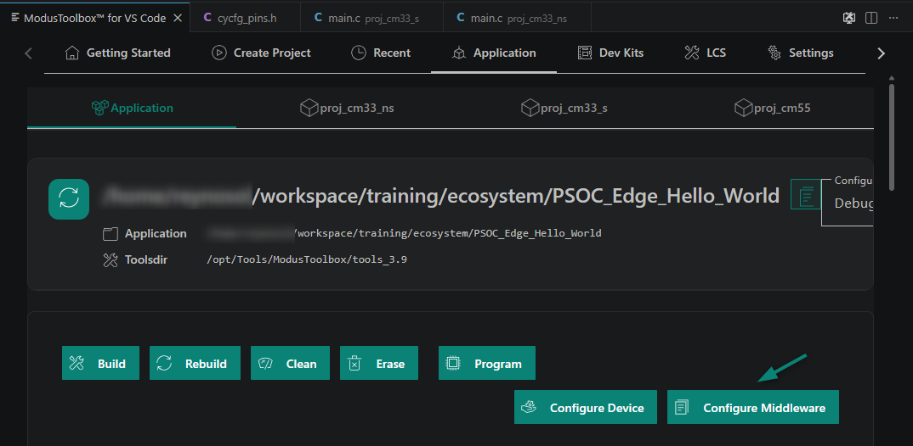

2. [INFO] Observe that the project already includes multiple libraries for the CM33 secure, CM33 non-secure, and CM55 projects. Libraries worth highlighting for this example are:

   - [mtb-dsl-pse8xxgp](https://infineon.github.io/mtb-dsl-pse8xxgp/html/index.html): provides all necessary device-specific components used during software development for the PSE8xxGP family of devices, including HAL and PDL drivers. `mtb-dsl-pse8xxgp` is included for all PSOC&trade; Edge examples in ModusToolbox&trade;.
   - [mtb-ipc](https://infineon.github.io/mtb-ipc/html/index.html): allows communication between multiple CPUs or between multiple tasks operating in different domains within a single CPU. This lab requires `mtb-ipc` on `proj_cm33_ns` and `proj_cm55` because the two cores communicate with each other. Observe that the library is enabled for both projects.
   - [retarget-io](https://infineon.github.io/retarget-io/html/index.html): retargets the standard input/output (STDIO) messages to a UART port. `retarget-io` is enabled for `proj_cm33_ns` and not for `proj_cm55`. This library is not required for IPC semaphores; however, this section shows how to move it to use `printf` in `proj_cm55`.

3. In `proj_cm33_ns`, click the cross icon to remove `retarget-io`, because it is not used on the CM33
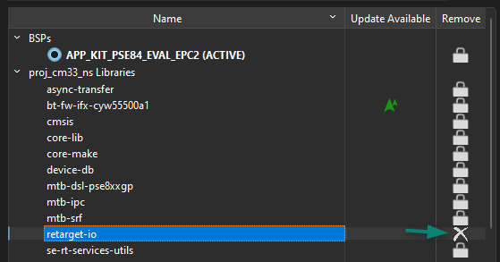
4. Click **Add Library**
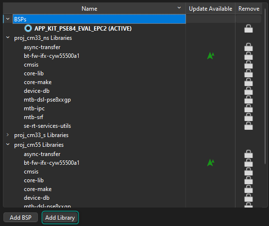

5. Select `proj_cm55` as the **Target Project**, enable the `retarget-io` library by selecting its checkbox, and then click **OK**
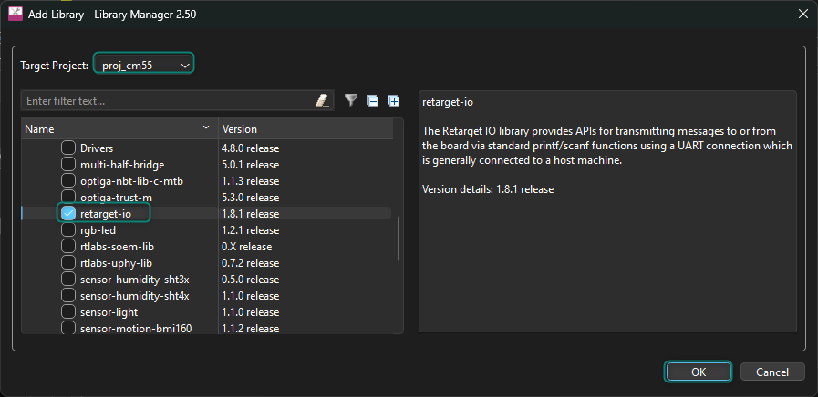

6. In the main Library Manager window, observe that `retarget-io` was removed from `proj_cm33_ns` and added to `proj_cm55`, and then click **Update** to add the library to the project
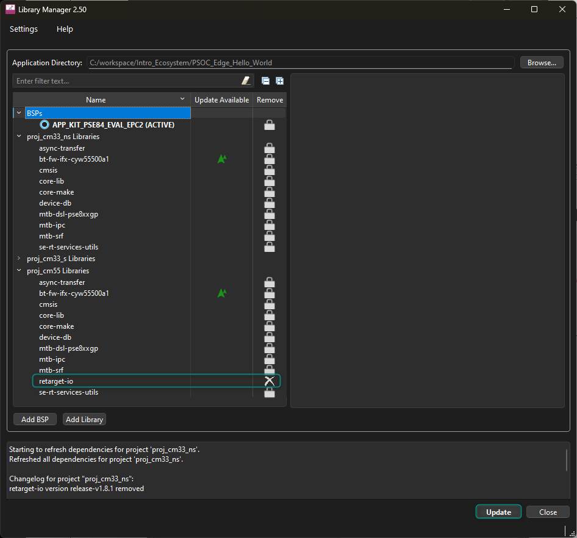

7. **Close** the Library Manager after the update completes

8. The `proj_cm33_ns` project includes `retarget_io_init.c` and `retarget_io_init.h` files to initialize the `retarget-io` library. Reuse these files for the `proj_cm55` project by cutting and pasting them, or by dragging and dropping them in the **EXPLORER** view
   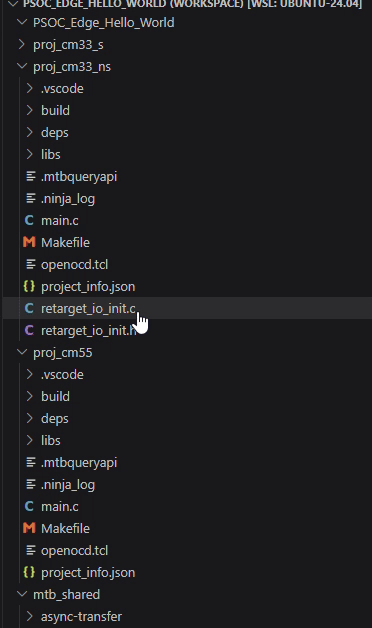

9. Open `proj_cm33_ns/main.c` and modify it to stop using `retarget-io` and `printf`.
```c
/*******************************************************************************
* Header Files
*******************************************************************************/
#include "cybsp.h"
//#include "retarget_io_init.h"
```
```c
int main(void)
{
    cy_rslt_t result = CY_RSLT_SUCCESS;

    /* Initialize the device and board peripherals. */
    result = cybsp_init();
    /* Board initialization failed. Stop program execution. */
    if (CY_RSLT_SUCCESS != result)
    {
        __disable_irq();
        CY_ASSERT(0);
        while (true);
    }

    /* Enable global interrupts. */
    __enable_irq();

    /* Enable CM55. */
    Cy_SysEnableCM55(MXCM55, CM55_APP_BOOT_ADDR, CM55_BOOT_WAIT_TIME_USEC);

    for (;;)
    {
        Cy_GPIO_Inv(CYBSP_USER_LED1_PORT, CYBSP_USER_LED1_PIN);
        Cy_SysLib_Delay(BLINKY_LED_DELAY_MSEC);
    }
}
```

9. Now, initialize `retarget-io` in `proj_cm55/main.c`, and use `printf` to display a message.

```c
/*******************************************************************************
* Header File
*******************************************************************************/
#include "cybsp.h"
#include "retarget_io_init.h"
```
```c
int main(void)
{
    cy_rslt_t result;

    /* Initialize the device and board peripherals. */
    result = cybsp_init();
    /* Board init failed. Stop program execution. */
    if (CY_RSLT_SUCCESS != result)
    {
        handle_app_error();
    }

    /* Enable global interrupts. */
    __enable_irq();
    init_retarget_io();
    /* \x1b[2J\x1b[;H - ANSI ESC sequence for clear screen */
    printf("\x1b[2J\x1b[;H");
    printf("********** PSOC Edge MCU: IPC Semaphore Example ********** \r\n");
    printf("CM55 initialization \r\n\n");

    /* Wait for UART traffic to stop. */
    while (!(Cy_SCB_UART_IsTxComplete(CYBSP_DEBUG_UART_HW))) {}

    /* Put the CPU to Deep Sleep. */
    for (;;)
    {
        Cy_SysPm_CpuEnterDeepSleep(CY_SYSPM_WAIT_FOR_INTERRUPT);
    }
}
```

10. Build and program the application

### Output

After the program runs successfully, open the serial terminal and configure the baud rate to 115200-8-N-1. Then press the kit reset button.

Observe that the CM55 CPU prints the welcome message, while the CM33 CPU is still blinking the LED at approximately 1 Hz.

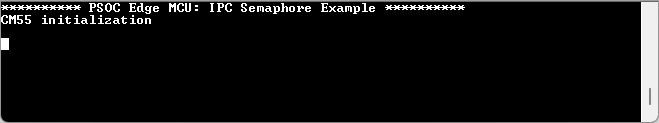
### Implement the GPIO button and print messages using both CPUs

In the previous section, we moved the retarget-io library to CM55; however, it is still possible for the CM33 to utilize the same UART. 
In this section, we will send UART messages from both CPUs when an EVK button is pressed.

1. Open the **Device Configurator** from the **Application** tab of the ModusToolbox&trade; Assistant, or run `make device-configurator` from a terminal.

2. In the Device Configurator, go to the **Pins** tab

3. [INFO] Observe that the user buttons on the PSOC&trade; Edge EVK are connected to **P8.3** and **P8.7**, as shown in the kit schematic.

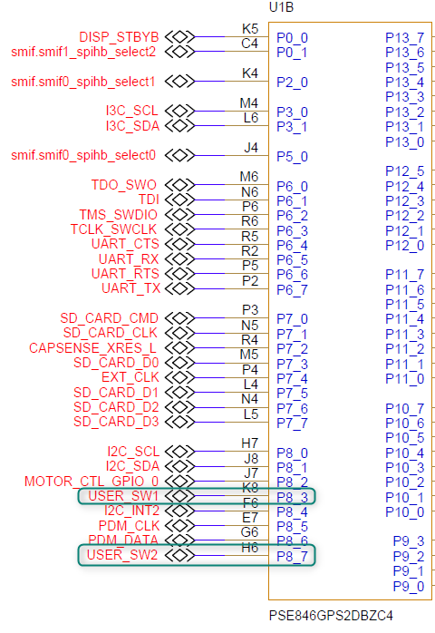

4. Rename **Port8[3]** as **TRAINING_BUTTON**. 
    We will use USER BTN1 to print messages in the application; it is connected to P8.3.
    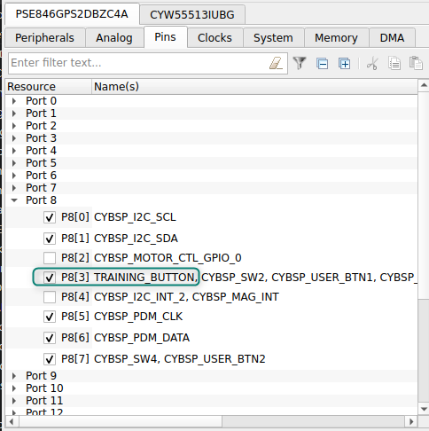

6. Select **File → Save** or press **Ctrl+S** to save `design.modus` and regenerate the source files.

7. Open `proj_cm33_ns/main.c` and modify the code to use the new button alias to print a message to the terminal.

> **Note:** We use a UART PDL function because the CM33 project does not include `retarget-io`. The GPIO and UART PDL functions are available in the [mtb-dsl-pse8xxgp](https://infineon.github.io/mtb-dsl-pse8xxgp/html/index.html) library.

```c
for (;;)
{
    if (Cy_GPIO_Read(TRAINING_BUTTON_PORT, TRAINING_BUTTON_PIN) == 0)
    {
        Cy_SCB_UART_PutString(CYBSP_DEBUG_UART_HW, "Message sent from CM33 \r\n");
    }
}
```

8. Now, open proj_cm55/main.c and modify the code to implement a similar functionality

> **Note:** Observe that we are using printf for CM55 since retarget-io was included.

```c
for (;;)
{
    if (Cy_GPIO_Read(TRAINING_BUTTON_PORT, TRAINING_BUTTON_PIN) == 0)
    {
        printf("Message sent from CM55 \r\n");
    }
}
```

9. Save the files, rebuild the project and program the device

### Output

After the program runs successfully, open the serial terminal and configure the baud rate to 115200-8-N-1. Then press the kit reset button.

Press USER_BTN1 on the EVK and observe that both devices will attempt to send messages to the terminal; however, the output is incorrect since no semaphores are implemented to synchronize access to UART.

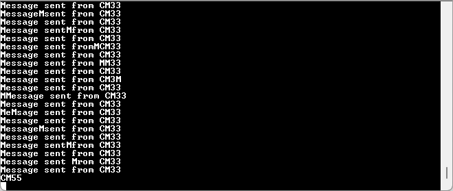

### Use an IPC semaphore to synchronize access to the UART

We previously observed that both CPUs can access the UART concurrently; however, this can result in problems when both cores attempt to write at the same time without synchronization.

In this section, we will use IPC semaphores to synchronize access.

1. Create a shared folder to facilitate sharing parameters between projects.

2. In VS Code's EXPLORER view, right-click the top level of the project and select **New Folder**, then name the folder **shared**.
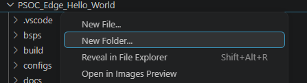

3. Repeat the process to create an **include** folder inside the **shared** folder.

4. Right-click the **shared/include** folder in the **EXPLORER** view, and select **New File**, then name the file **ipc_def.h**.
   The project should look as follows:
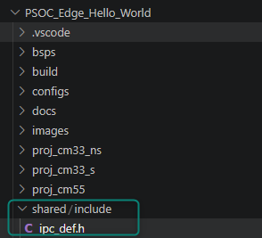

5. Add the following code to the newly created ipc_def.h file
```c
#ifndef IPC_DEF_H
#define IPC_DEF_H

/* IPC Channel to use */
#define IPC_CHANNEL_NUM 8U

/* Semaphore number to be used in this example. Semaphores 0-15 are reserved
 * for system use. */
#define MAX_SEMA_NUM 32U
#define MY_SEMA_NUM 16U

/* Delay to allow other core to acquire the semaphore */
#define SEMA_DELAY 10U

#endif /* IPC_DEF_H */
```

6. Add the **shared/include** path to **proj_cm33_ns/Makefile** and **proj_cm55/Makefile**.

> **Note:** The Makefile for both projects needs to be updated since we will access ipc_def.h from both projects.

```makefile
# Like SOURCES, but for include directories. Value should be paths to
# directories (without a leading -I).
INCLUDES+=../shared/include
```

7. Open **proj_cm33_ns/main.c** and add code to initialize the semaphore

> **Note:** Observe that a region in shared memory is used to declare the semaphore variable since it needs to be accessed by both CPUs.

```c
/*******************************************************************************
* Header Files
*******************************************************************************/
#include "cybsp.h"
#include "ipc_def.h"

/*********************************************************************************
* Global variables
*********************************************************************************/
CY_SECTION_SHAREDMEM uint32_t sema_data[CY_IPC_SEMA_COUNT / CY_IPC_SEMA_PER_WORD];
```
```c
int main(void)
{
    cy_rslt_t result = CY_RSLT_SUCCESS;
    cy_en_ipcsema_status_t ipc_status;

    /* Initialize the device and board peripherals. */
    result = cybsp_init();
    /* Board initialization failed. Stop program execution. */
    if (CY_RSLT_SUCCESS != result)
    {
        __disable_irq();
        CY_ASSERT(0);
        while (true);
    }

    /* Enable global interrupts. */
    __enable_irq();
    ipc_status = Cy_IPC_Sema_Init(IPC_CHANNEL_NUM, CY_IPC_SEMA_COUNT, sema_data);
    if (CY_IPC_SEMA_SUCCESS != ipc_status)
    {
        __disable_irq();
        CY_ASSERT(0);
        while (true);
    }

    /* Enable CM55. */
    Cy_SysEnableCM55(MXCM55, CM55_APP_BOOT_ADDR, CM55_BOOT_WAIT_TIME_USEC);
    Cy_SysLib_Delay(SEMA_DELAY);

    for (;;)

```

8. Then, add the code to synchronize access to the UART.
```c
for (;;)
{
	if (Cy_GPIO_Read(TRAINING_BUTTON_PORT, TRAINING_BUTTON_PIN) == 0)
	{
		/* Acquire semaphore */
		while (Cy_IPC_Sema_Set(MY_SEMA_NUM, false) != CY_IPC_SEMA_SUCCESS)
			;
		Cy_SCB_UART_PutString(CYBSP_DEBUG_UART_HW, "Message sent from CM33 \r\n");
		while (!(Cy_SCB_UART_IsTxComplete(CYBSP_DEBUG_UART_HW))) {}
		/* Release semaphore */
		while (Cy_IPC_Sema_Clear(MY_SEMA_NUM, false) != CY_IPC_SEMA_SUCCESS)
			;
	}
}
```

9. Now, open **proj_cm55/main.c** and add code to initialize the semaphore

> **Note:** Observe that the **sema_data** variable does not need to be declared again.

```c
/*******************************************************************************
* Header File
*******************************************************************************/
#include "cybsp.h"
#include "retarget_io_init.h"
#include "ipc_def.h"
```
```c
int main(void)
{
    cy_rslt_t result;
    cy_en_ipcsema_status_t ipc_status;

    /* Initialize the device and board peripherals. */
    result = cybsp_init();
    /* Board init failed. Stop program execution. */
    if (CY_RSLT_SUCCESS != result)
    {
        handle_app_error();
    }

    /* Enable global interrupts. */
    __enable_irq();
    ipc_status = Cy_IPC_Sema_Init(IPC_CHANNEL_NUM, 0UL, NULL);
    if (ipc_status != CY_IPC_SEMA_SUCCESS)
    {
        handle_app_error();
    }
    init_retarget_io();
    /* \x1b[2J\x1b[;H - ANSI ESC sequence for clear screen */
```

10. Lastly, use the semaphore to synchronize access to UART.
```c
    for (;;)
    {
        if (Cy_GPIO_Read(TRAINING_BUTTON_PORT, TRAINING_BUTTON_PIN) == 0)
        {
            /* Acquire semaphore */
            while (Cy_IPC_Sema_Set(MY_SEMA_NUM, false) != CY_IPC_SEMA_SUCCESS)
                ;
            printf("Message sent from CM55 \r\n");
            while (!(Cy_SCB_UART_IsTxComplete(CYBSP_DEBUG_UART_HW))) {}
            /* Release semaphore */
            while (Cy_IPC_Sema_Clear(MY_SEMA_NUM, false) != CY_IPC_SEMA_SUCCESS)
                ;
        }
    }
```
11. Save the files, rebuild the project, and reprogram the device.

### Output

After the program runs successfully, open the serial terminal and configure the baud rate to 115200-8-N-1. Then press the kit reset button.

Press USER_BTN1 on the EVK and observe that both devices will send messages to the terminal and now that IPC semaphores are used to synchronize access, both cores can print the complete message successfully.


### Conclusion

We successfully learned how to use the Library Manager to add and remove libraries on both CPUs, implemented code to access a shared resource, and synchronized that access with an IPC semaphore.

This demonstrates IPC’s effectiveness for coordinating access between processors, and it can also be used to exchange messages between them.

<a id="appendix-a"></a>

## Appendix A: Creating a PSOC&trade; Edge application in ModusToolbox&trade;

The following steps show how to create a new project for PSOC&trade; Edge in ModusToolbox&trade;, using either Visual Studio Code (VS Code) or the command-line interface (CLI).

### Creating an application using VS Code

This appendix shows a quick workflow to create and open a new PSOC&trade; Edge "Hello World" application using ModusToolbox&trade; and Visual Studio Code.

1. Open **ModusToolbox&trade; Dashboard**. Select **Microsoft Visual Studio Code** as the target IDE, then launch **Project Creator**.
    If you have not installed ModusToolbox&trade; or Visual Studio Code, see the [Required development tools](#required-development-tools-and-prerequisites) section.

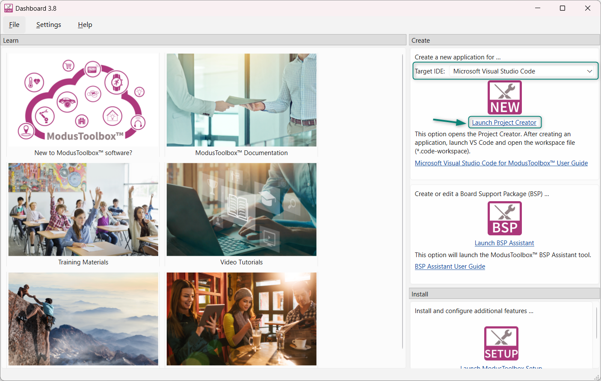

2. Choose the PSOC&trade; Edge BSP that matches your kit. This training will be using the **KIT_PSE84_EVAL_EPC2**. Then, click Next.
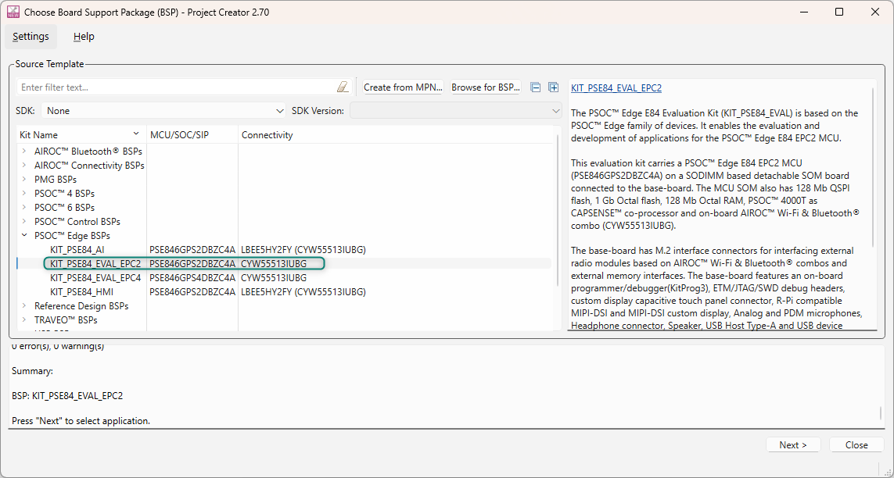

3. Select a **path** for your project, make sure the **target IDE** is Microsoft Visual Studio Code, and  then select the **"Hello World"** project under **"Getting Started"** section.
   Optionally, rename the project desired and click on **Create**.

> **Note:** Windows has a 260-character path length limit. A long workspace path and/or a long project name may cause build issues when creating some applications.
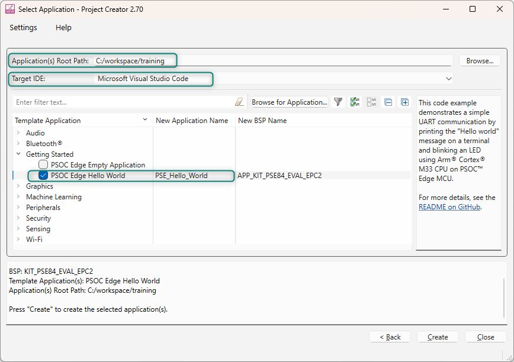

4. After project generation completes, open the generated workspace in Visual Studio Code by opening the .code-workspace file created in the project folder.
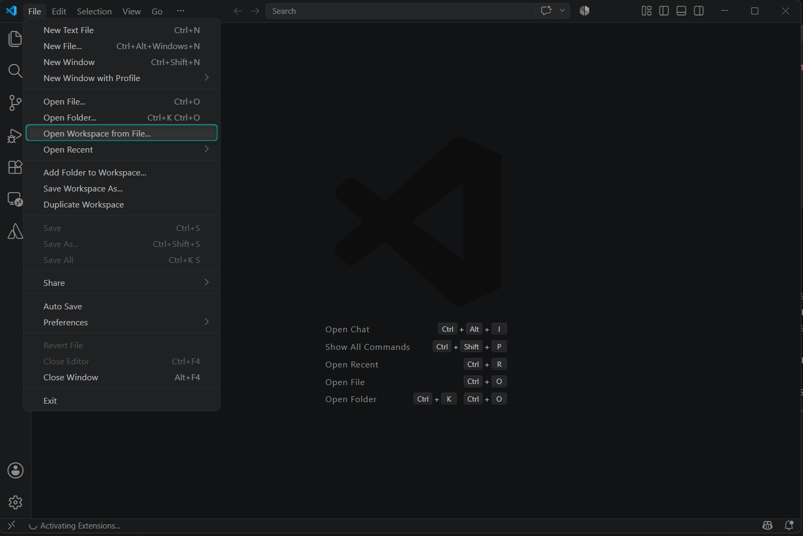

5. The project will be imported and you should be able to see all the files in Visual Studio Code, and the **ModusToolbox&trade; for VS Code extension** can be used to build and program the project.

> **Note:** The **ModusToolbox&trade; for VS Code extension** might show some warnings. Click the corresponding buttons to fix the configuration issues.
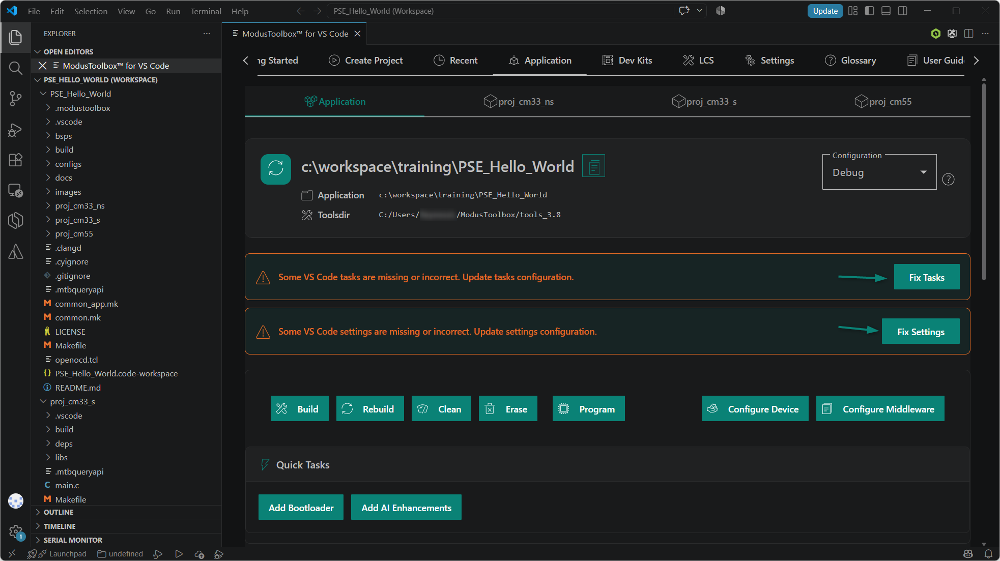

### Creating an application using the CLI

ModusToolbox&trade; also includes a `project-creator-cli` tool so you can create applications without a GUI, or automate project creation in scripts.

> **Note:** On Windows, run CLI commands from the **modus-shell** (Cygwin) terminal included with the ModusToolbox&trade; installation, instead of a standard Windows command-line application. This shell provides access to all ModusToolbox&trade; tools. On Linux and macOS, you can use any terminal application.

1. Open a modus-shell (Windows) or terminal (Linux/macOS) window, and navigate to the folder where you want to create the application

2. Run the following command to list the available code examples for the **KIT_PSE84_EVAL_EPC2** BSP

```bash
project-creator-cli --list-apps KIT_PSE84_EVAL_EPC2
```

3. Run the following command to create the **PSOC&trade; Edge Hello World** application

```bash
project-creator-cli --board-id KIT_PSE84_EVAL_EPC2 --app-id mtb-example-psoc-edge-hello-world --user-app-name PSOC_Edge_Hello_World
```

4. You can build, program, and open other ModusToolbox&trade; tools directly from the modus-shell or terminal, for example `make build`, `make program`, `make device-configurator`, `make library-manager`, etc.
    Visit the [ModusToolbox&trade; user guide](https://www.infineon.com/modustoolboxuserguide) for more information.

## Appendix B: KIT_PSE84_EVAL details

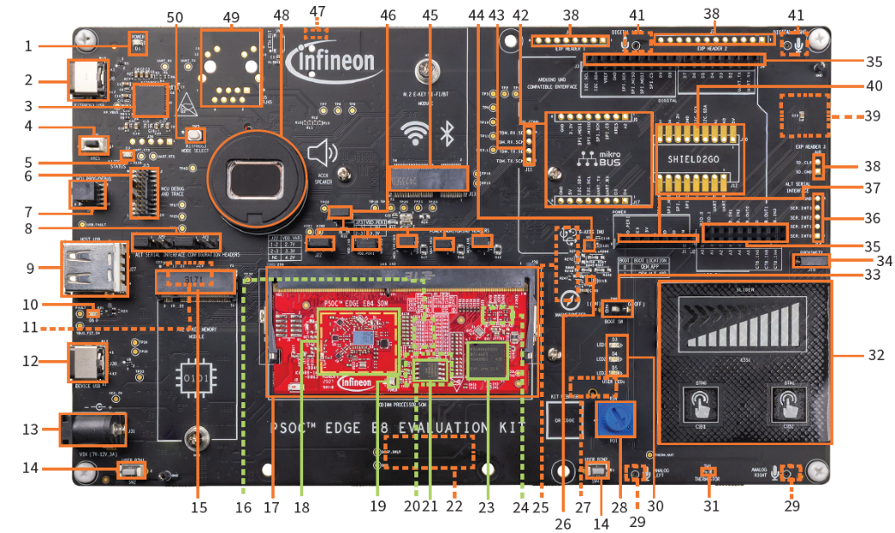

| No. | Item | No. | Item |
| ---: | --- | ---: | --- |
| 1 | Baseboard power LED (D1) | 26 | 3-axis magnetometer (U4) |
| 2 | KitProg3 program/debug USB-C connector (J8) | 27 | Raspberry Pi-compatible display capacitive touch connector (J41)** |
| 3 | PSOC&trade; 5LP-based KitProg3 programmer and debugger (CY8C5868LTI-LP039, U2) | 28 | Linear potentiometer (R34) |
| 4 | Reset button (SW1) | 29 | Analog microphones (IM73A135V01XTSA1, U36 and U37)** |
| 5 | KitProg3 status LED (D2) | 30 | User LEDs (D3, D4, D5) |
| 6 | PSOC&trade; Edge E84 MCU ETM/JTAG debug and trace header (J15) | 31 | Thermistor (TH1) |
| 7 | PSOC&trade; Edge E84 MCU 10-pin SWD/JTAG program and debug header (J16) | 32 | CAPSENSE&trade; buttons and slider (CSB1, CSB2, CSS1) |
| 8 | Alternative serial interface configuration headers (J20, J21) | 33 | BOOT configuration switch (SW6) |
| 9 | PSOC&trade; Edge E84 MCU USB host Type-A connector (J27) | 34 | Proximity sense connector (J19) |
| 10 | USB-C power delivery (PD) fault LED (D6) | 35 | I/O headers compatible with Arduino UNO R3 (J2, J3, J4) |
| 11 | Custom display capacitive touch panel connector (J37)** | 36 | Alternative serial interface I/O header (J14)* |
| 12 | PSOC&trade; Edge E84 MCU USB-C connector (J30) | 37 | Power header compatible with Arduino UNO R3 (J1) |
| 13 | External power supply VIN connector (J31) | 38 | PSOC&trade; Edge E84 MCU expansion I/O headers (J6, J7, J40)* |
| 14 | PSOC&trade; Edge E84 MCU user buttons (SW2, SW4) | 39 | MicroSD card holder (J35)** |
| 15 | M.2 (B-key) memory interface connector (J29) | 40 | Infineon's Shield2Go interface headers (J10, J12)* |
| 16 | 128 Mbit Octal-SPI HYPERRAM&trade; (S70KS1283GABHI020, U12)*** | 41 | Analog microphones (IM73A135V01XTSA1, U36 and U37)** |
| 17 | Processor System on module (SoM) 260-pin SODIMM connector (J28) | 42 | mikroBUS compatible headers by Mikroelektronika (J9, J17)* |
| 18 | CYW55513 tri-band (Wi-Fi & Bluetooth®) combo radio (U3) section | 43 | Extended I2S header (J11)* |
| 19 | Processor System on module (SoM) power LED (D3) | 44 | 6-axis accelerometer and gyroscope IMU (U5) |
| 20 | 1-Gb Octal-SPI NOR flash (S28HS01GTGZBH1030, U10)*** | 45 | M.2 (E-key) radio interface connector (J13) |
| 21 | 128-Mb Quad-SPI NOR flash (S25FS128SAGMFB100, U11) | 46 | PSOC&trade; Edge E84 MCU power selection/monitoring headers (J18, J22, J23, J24, J25, J26) |
| 22 | MIPI-DSI custom display connector (J38)** | 47 | Headphone connector (J34)* |
| 23 | PSOC&trade; Edge E84 MCU (PSE846GPS2DBZC4A, U1) | 48 | Speaker (ACC6) |
| 24 | PSOC&trade; 4000T CAPSENSE&trade; Co-processor (U9)*** | 49 | RJ45 Ethernet MagJack connector (J5)* |
| 25 | Raspberry Pi-compatible MIPI-DSI display connector (J39)** | 50 | KitProg3 programming mode selection button (SW3) |

\*Footprint only, not populated on the board

\*\*Component at the bottom side of the Baseboard

\*\*\*Component at the bottom side of the SoM
## Revision history

<table class="no-center-table">
    <thead>
        <tr>
            <th>Document revision</th>
            <th>Date</th>
            <th>Description of changes</th>
        </tr>
    </thead>
    <tbody>
        <tr>
            <td>*B</td>
            <td>2026-05-04</td>
            <td>Updated tool versions; migrated instructions from Eclipse IDE to Visual Studio Code; added CLI equivalent instructions.</td>
        </tr>
        <tr>
            <td>*A</td>
            <td>2026-05-04</td>
            <td>Updated template.</td>
        </tr>
        <tr>
            <td>**</td>
            <td>2026-03-15</td>
            <td>Initial release.</td>
        </tr>
    </tbody>
</table>

### Disclaimer
All referenced product or service names and trademarks are the property of their respective owners.

The Bluetooth® word mark and logos are registered trademarks owned by Bluetooth SIG, Inc., and any use of such marks by Infineon is under license.

PSOC&trade;, formerly known as PSoC&trade;, is a trademark of Infineon Technologies. Any references to PSoC&trade; in this document or others shall be deemed to refer to PSOC&trade;.

---------------------------------------------------------

© Cypress Semiconductor Corporation, 2023-2026. This document is the property of Cypress Semiconductor Corporation, an Infineon Technologies company, and its affiliates ("Cypress").  This document, including any software or firmware included or referenced in this document ("Software"), is owned by Cypress under the intellectual property laws and treaties of the United States and other countries worldwide.  Cypress reserves all rights under such laws and treaties and does not, except as specifically stated in this paragraph, grant any license under its patents, copyrights, trademarks, or other intellectual property rights.  If the Software is not accompanied by a license agreement and you do not otherwise have a written agreement with Cypress governing the use of the Software, then Cypress hereby grants you a personal, non-exclusive, nontransferable license (without the right to sublicense) (1) under its copyright rights in the Software (a) for Software provided in source code form, to modify and reproduce the Software solely for use with Cypress hardware products, only internally within your organization, and (b) to distribute the Software in binary code form externally to end users (either directly or indirectly through resellers and distributors), solely for use on Cypress hardware product units, and (2) under those claims of Cypress's patents that are infringed by the Software (as provided by Cypress, unmodified) to make, use, distribute, and import the Software solely for use with Cypress hardware products.  Any other use, reproduction, modification, translation, or compilation of the Software is prohibited.
<br>
TO THE EXTENT PERMITTED BY APPLICABLE LAW, CYPRESS MAKES NO WARRANTY OF ANY KIND, EXPRESS OR IMPLIED, WITH REGARD TO THIS DOCUMENT OR ANY SOFTWARE OR ACCOMPANYING HARDWARE, INCLUDING, BUT NOT LIMITED TO, THE IMPLIED WARRANTIES OF MERCHANTABILITY AND FITNESS FOR A PARTICULAR PURPOSE.  No computing device can be absolutely secure.  Therefore, despite security measures implemented in Cypress hardware or software products, Cypress shall have no liability arising out of any security breach, such as unauthorized access to or use of a Cypress product. CYPRESS DOES NOT REPRESENT, WARRANT, OR GUARANTEE THAT CYPRESS PRODUCTS, OR SYSTEMS CREATED USING CYPRESS PRODUCTS, WILL BE FREE FROM CORRUPTION, ATTACK, VIRUSES, INTERFERENCE, HACKING, DATA LOSS OR THEFT, OR OTHER SECURITY INTRUSION (collectively, "Security Breach").  Cypress disclaims any liability relating to any Security Breach, and you shall and hereby do release Cypress from any claim, damage, or other liability arising from any Security Breach.  In addition, the products described in these materials may contain design defects or errors known as errata which may cause the product to deviate from published specifications. To the extent permitted by applicable law, Cypress reserves the right to make changes to this document without further notice. Cypress does not assume any liability arising out of the application or use of any product or circuit described in this document. Any information provided in this document, including any sample design information or programming code, is provided only for reference purposes.  It is the responsibility of the user of this document to properly design, program, and test the functionality and safety of any application made of this information and any resulting product.  "High-Risk Device" means any device or system whose failure could cause personal injury, death, or property damage.  Examples of High-Risk Devices are weapons, nuclear installations, surgical implants, and other medical devices.  "Critical Component" means any component of a High-Risk Device whose failure to perform can be reasonably expected to cause, directly or indirectly, the failure of the High-Risk Device, or to affect its safety or effectiveness.  Cypress is not liable, in whole or in part, and you shall and hereby do release Cypress from any claim, damage, or other liability arising from any use of a Cypress product as a Critical Component in a High-Risk Device. You shall indemnify and hold Cypress, including its affiliates, and its directors, officers, employees, agents, distributors, and assigns harmless from and against all claims, costs, damages, and expenses, arising out of any claim, including claims for product liability, personal injury or death, or property damage arising from any use of a Cypress product as a Critical Component in a High-Risk Device. Cypress products are not intended or authorized for use as a Critical Component in any High-Risk Device except to the limited extent that (i) Cypress's published data sheet for the product explicitly states Cypress has qualified the product for use in a specific High-Risk Device, or (ii) Cypress has given you advance written authorization to use the product as a Critical Component in the specific High-Risk Device and you have signed a separate indemnification agreement.
<br>
Cypress, the Cypress logo, and combinations thereof, ModusToolbox, PSoC, CAPSENSE, EZ-USB, F-RAM, and TRAVEO are trademarks or registered trademarks of Cypress or a subsidiary of Cypress in the United States or in other countries. For a more complete list of Cypress trademarks, visit www.infineon.com. Other names and brands may be claimed as property of their respective owners.